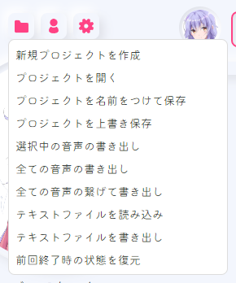
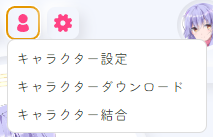
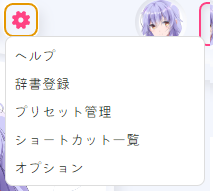

# COEIROINK 음성 합성 (Text-to-Speech)

## 1. 개요 (Overview)
COEIROINK는 일본어를 중심으로 한 **텍스트 음성 합성(TTS) 프로그램**입니다.  
자연스러운 대사형 음성을 생성할 수 있으며, 다양한 캐릭터 음성을 추가로 다운로드하여 사용할 수 있습니다.  
VoiceScriptPlayer에서는 **대본 음성화, 캐릭터 보이스 합성** 등에 활용할 수 있습니다.  

---

## 2. 설치 및 준비 (Installation & Setup)
1. **COEIROINK 다운로드**  
   [공식 다운로드 페이지](https://coeiroink.com/download)에서 최신 버전을 내려받습니다.  

   - **CPU 버전**  
     - 모든 PC에서 실행 가능  
     - 속도가 느릴 수 있으나, GPU가 없는 환경에서 안정적으로 사용 가능  

   - **GPU 버전 (CUDA 사용)**  
     - NVIDIA GPU 환경에서 동작  
     - CPU 대비 3~10배 빠른 처리 속도  
     - 실행을 위해 **CUDA(권장 11.8)** 가 설치되어 있어야 합니다.  
     - [CUDA 다운로드 페이지](https://developer.nvidia.com/cuda-11-8-0-download-archive)  

   

2. **실행 준비**  
   - COEIROINK는 설치 과정이 없습니다.  
   - 다운로드한 압축(zip) 파일을 원하는 위치에 해제한 뒤,  
     그 안의 **`COEIROINK.exe`** 파일을 직접 실행하면 됩니다.  
   - 기본 경로 변경이나 관리자 권한 실행은 필요하지 않습니다.  
   

3. **첫 실행 시 약관 동의**  
   - COEIROINK를 처음 실행하면 **이용 규약(利用規約)** 동의 화면이 표시됩니다.  
   - 반드시 "利用規約" 버튼을 눌러 내용을 확인해야 왼쪽의 **「同意する(동의하기)」 버튼**이 활성화됩니다.  
   - 동의하지 않으면 프로그램을 종료할 수밖에 없으므로, 반드시 동의 후 사용해야 합니다.  
   - 또한 COEIROINK를 이용할 때는 **크레딧 표기**가 필수입니다. (예: `COEIROINK:合成音声名`)  
   

---

## 3. 설정 방법 (Configuration)
COEIROINK는 실행만 해두면 VoiceScriptPlayer가 자동으로 연결할 수 있습니다.  
아래는 프로그램 상단 메뉴별 설명입니다.

---

### 📂 프로젝트 메뉴

- **新規プロジェクトを作成** → 새 프로젝트 만들기  
- **プロジェクトを開く** → 기존 프로젝트 열기  
- **プロジェクトを名前をつけて保存** → 새 이름으로 저장  
- **プロジェクトを上書き保存** → 덮어쓰기 저장  
- **選択中の音声の書き出し** → 선택한 음성만 내보내기  
- **全ての音声の書き出し** → 모든 음성 내보내기  
- **全ての音声の繋げて書き出し** → 모든 음성을 이어서 내보내기  
- **テキストファイルを読み込み** → 텍스트 파일 불러오기  
- **テキストファイルを書き出し** → 텍스트 파일로 저장  
- **前回終了時の状態を復元** → 이전 실행 시 상태 복원  

---

### 👤 캐릭터 메뉴

- **キャラクター設定** → 캐릭터 설정 (프로필, 이름 등)  
- **キャラクターダウンロード** → 캐릭터 다운로드 (공식 라이브러리에서 음성 추가)  
- **キャラクター結合** → 캐릭터 병합 (여러 캐릭터 데이터 통합)  

---

### ⚙️ 설정 메뉴

- **ヘルプ** → 도움말  
- **辞書登録** → 사용자 사전 등록 (발음/단어 보정)  
- **プリセット管理** → 프리셋 관리 (설정값 저장/불러오기)  
- **ショートカット一覧** → 단축키 목록  
- **オプション** → 옵션 (API 포트, 기본 동작 설정 등)  

---

### 🎛️ 음성 조절 패널
- **話速 (화속)** → 말하는 속도 (기본값 1.0)  
- **声の高さ** → 목소리 높낮이 (Pitch)  
- **加工手法** → 처리 방식 (예: TD-PSOLA)  
- **強さ** → 발화 강도  
- 각 항목에는 -5/-1/+1/+5 버튼으로 미세 조절 가능  

---

### 💬 텍스트 입력 & 실행
- 하단 입력창에 텍스트 입력 후 ▶ 버튼 클릭 → 음성 합성 실행  
- 🔄 버튼 → 합성 재실행  
- 💾 버튼 → 음성을 파일로 저장  

---

## 4. 사용 방법 (Usage)
1. `COEIROINK.exe` 실행  
2. VoiceScriptPlayer에서 대본 입력  
3. 사용할 캐릭터 및 스타일 선택  
4. "재생" 버튼 클릭 → COEIROINK에서 음성이 합성됨  
5. 생성된 음성을 프로젝트에 삽입하거나 파일로 저장 가능  

---

## 5. 주의사항 (Notes & Limitations)
- COEIROINK는 **설치형 프로그램이 아니라 실행 파일 방식**으로 제공됩니다.  
- Windows 전용 지원 (Mac/Linux는 미지원)  
- CPU 버전은 느리지만 호환성이 좋고, GPU 버전은 빠르지만 **NVIDIA GPU + CUDA(권장 11.8)** 환경이 필요합니다.  
- 일부 보이스는 **상업적 이용 불가**일 수 있으므로 반드시 보이스별 라이선스를 확인하세요.  
- API 포트(`50032`)가 다른 프로그램과 충돌할 경우 설정에서 변경해야 합니다.  
- **COEIROINK 이용 시 크레딧 표기(예: `COEIROINK:합성음성명`)는 필수입니다.**

---

## 6. 라이선스 및 출처 (License & Credits)
- **COEIROINK 본체**: 무료 배포 (비상업/상업 사용 가능)  
- **보이스 데이터**: 각 제작자별 라이선스 상이  
- 공식 사이트: [https://coeiroink.com/](https://coeiroink.com/)  

---

## 7. 문제 해결 (Troubleshooting / FAQ)
- ❓ *"VoiceScriptPlayer에서 COEIROINK를 찾을 수 없습니다."*  
  → `COEIROINK.exe`가 실행 중인지 확인하세요.  

- ❓ *"API 연결에 실패했습니다."*  
  → COEIROINK가 실행 중인지, 포트(`50032`)가 다른 프로그램과 충돌하지 않는지 확인하세요.  

- ❓ *"보이스가 목록에 표시되지 않습니다."*  
  → COEIROINK 내에서 보이스 라이브러리를 추가했는지 확인하세요.  

- ❓ *"속도가 너무 느립니다."*  
  → GPU 버전을 설치하거나, 짧은 대사 단위로 나눠서 합성하세요.  
