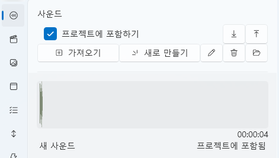
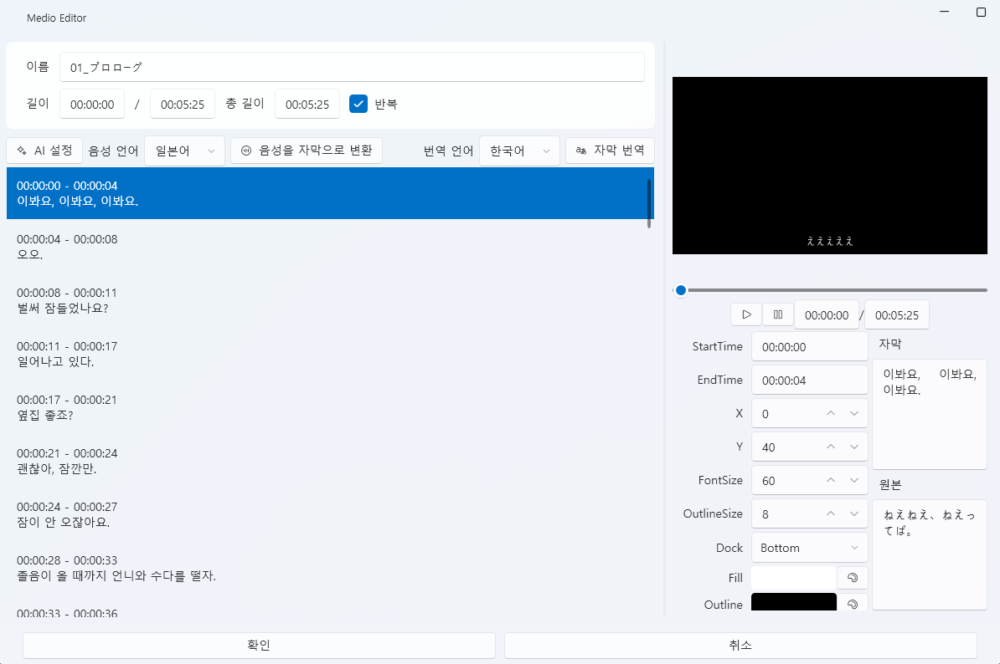
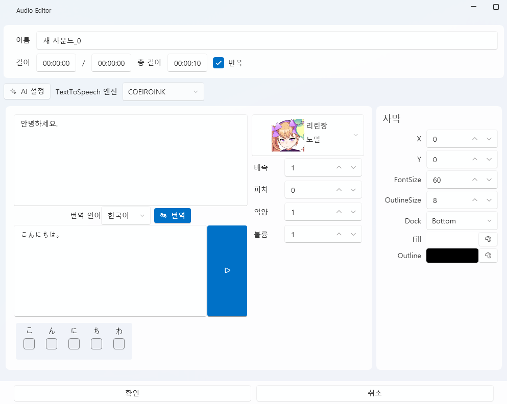

# 사운드 탭

VoiceScriptPlayer의 **사운드 탭**은 프로젝트의 핵심이 되는 오디오를 관리하고,  
자막(STT), 번역, 음성 합성(TTS) 기능을 수행하는 편집 탭입니다.  
모든 트랙과 이벤트는 사운드를 기준으로 동기화됩니다.

---

## 1. 기본 인터페이스

사운드 탭은 프로젝트에서 사용하는 모든 오디오 파일을 관리하는 곳입니다.  
TTS 생성, 자막 설정, 파일 가져오기 등 대부분의 음성 관련 기능이 이곳에서 수행됩니다.

| 구성 요소 | 설명 |
|------------|------|
| **① 프로젝트에 포함하기** | 체크하면 불러온 사운드가 **프로젝트 내부 폴더에 복사**됩니다. 체크 해제 시, 외부 파일을 **참조만** 하며 실제 파일은 복사되지 않습니다. |
| **② 가져오기** | 로컬 디스크에서 `.wav`, `.mp3` 파일을 불러옵니다. “프로젝트에 포함하기” 상태에 따라 복사 또는 참조로 동작합니다. |
| **③ 새로 만들기** | TTS 음성을 새로 생성합니다. 클릭 시 **TTS 생성 창**이 열리며, 입력한 대사를 지정한 음성 엔진(COEIROINK 등)으로 합성합니다. |
| **④ 편집 ✏️** | 선택한 사운드의 상세 편집 창을 엽니다. 불러온 음성은 **자막 설정 창**, 생성한 TTS 음성은 **TTS 편집 창**이 표시됩니다. |
| **⑤ 삭제 🗑️** | 선택한 사운드를 목록에서 제거합니다. |
| **⑥ 내보내기 ↗ / 다시 가져오기 ↙** | 이미 프로젝트에 포함된 사운드를 외부 폴더로 내보내거나, 다시 프로젝트에 포함시킵니다. |
| **⑦ 사운드 폴더 열기 📂** | 현재 프로젝트의 **사운드 파일이 저장된 폴더**를 바로 엽니다. |
| **⑧ 파형 미리보기 영역** | 선택한 사운드의 파형과 길이를 표시합니다. 하단에는 파일 이름, 재생 길이, 포함 여부가 표시됩니다. |

---

### ⚙️ 동작 요약

| 상황 | 결과 |
|------|------|
| `프로젝트에 포함` 체크 후 가져오기 | 파일이 프로젝트 폴더(`Asset/Sound/`)로 **복사**됩니다. |
| 체크 해제 후 가져오기 | 파일은 **외부 참조**로만 등록되며, 실제 파일은 이동하지 않습니다. |
| “외부로 내보내기” 버튼 사용 | 선택된 사운드를 지정 폴더에 복사합니다. |
| “다시 프로젝트로 가져오기” 버튼 사용 | 외부에 있던 사운드를 다시 프로젝트 내로 복원합니다. |

---

> 💡 **팁:**  
> “프로젝트에 포함하기” 체크를 **해제**하면 다음과 같은 장점이 있습니다:
>
> - ✅ **프로젝트 용량 절감:** 큰 음성 파일이 복사되지 않아 저장 공간을 절약할 수 있습니다.  
> - ⚡ **빠른 로딩:** 복사 과정이 생략되어 가져오기 속도가 빨라집니다.  
> - 🛠️ **외부 수정 용이:** 외부에서 직접 편집(예: 오디오 교체, 노이즈 제거 등)한 파일이 즉시 반영됩니다.  
> - 🧾 **저작권 보호:** 유료 음원이나 상업용 음성을 프로젝트 내부에 포함하지 않아도 됩니다.  
>
> 단, 이렇게 참조한 음원은 **내보내기(게시)** 시 자동 제외되어,  
> 다른 사용자에게 배포해도 **음원 파일은 포함되지 않습니다.**

---

## 2. 자막 설정 (Medio Editor)

사운드 파일을 선택하고 **✏️ 편집** 버튼을 누르면  
`Medio Editor` 창이 열리며, 자막 생성(STT), 번역, 위치 조정 등을 한 번에 수행할 수 있습니다.

---

### 🎛️ 기본 구성

| 항목 | 설명 |
|------|------|
| **이름** | 현재 편집 중인 음성 파일의 이름입니다. |
| **길이 / 총 길이** | 사운드의 재생 구간과 전체 길이를 표시합니다. |
| **반복** | 체크 시, 음성이 끝나면 자동으로 반복 재생됩니다. |
| **AI 설정** | Whisper, DeepL 등 AI 엔진의 옵션을 바로 열어 설정할 수 있습니다. 설정 변경을 위해 창을 닫을 필요가 없습니다. |
| **음성 언어** | STT에서 사용할 음성의 언어를 선택합니다. (예: 일본어, 한국어, 영어 등) |
| **번역 언어** | 번역 시 사용할 목표 언어를 지정합니다. |
| **미리보기 영상 창** | 자막이 미리 표시됩니다. |
| **자막 목록 (오른쪽)** | 변환된 자막의 시간 구간, 위치 등을 개별 수정할 수 있습니다. |

---

### 🗣️ 음성을 자막으로 변환 (STT)

1. **음성 언어**를 설정합니다.  
2. **[음성을 자막으로 변환]** 버튼을 클릭합니다.  
3. 등록된 **STT 엔진**(예: Whisper 등)을 사용해 음성을 텍스트로 변환합니다.  
4. 결과는 자동으로 **시간 단위별 자막 목록**으로 표시됩니다.

| 항목 | 설명 |
|------|------|
| **StartTime / EndTime** | 자막의 시작·끝 시간을 조정합니다. |
| **자막 내용** | 변환된 텍스트가 표시되며, 직접 수정할 수 있습니다. |
| **X / Y** | 화면에서 자막의 표시 위치를 지정합니다. |
| **FontSize / OutlineSize** | 자막의 글자 크기와 외곽선 두께를 조절합니다. |
| **Dock** | 자막의 기준 위치(상단, 중앙, 하단 등)를 선택합니다. |
| **Fill / Outline** | 자막의 색상 및 외곽선 색상을 설정합니다. |

> 💡 **참고:**  
> 변환된 자막은 프로젝트의 `Asset/Sound/` 폴더에 자동 저장되며,  
> 필요 시 다른 음성이나 비디오에 재활용할 수 있습니다.

---

### 🌐 자막 번역

1. 음성을 자막으로 변환한 후 **[자막 번역]** 버튼을 클릭합니다.  
2. 선택된 **번역 엔진**(DeepL, LibreTranslate 등)을 사용하여  
   `음성 언어 → 번역 언어` 로 자동 번역이 수행됩니다.  
3. 번역된 자막은 원본과 나란히 표시되며, 필요 시 개별 수정이 가능합니다.

| 옵션 | 설명 |
|------|------|
| **자동 번역 엔진** | 설정에서 지정된 번역 API를 사용합니다. |
| **결과 미리보기** | 자막 미리보기 창에서 번역 결과를 즉시 확인할 수 있습니다. |
| **편집 반영** | 번역된 자막을 선택 후 오른쪽 패널에서 직접 수정할 수 있습니다. |

> 💡 **팁:**  
> - 일본어 음성을 한국어로 번역하려면 **음성 언어=일본어**, **번역 언어=한국어**로 설정합니다.  
> - 번역된 자막은 **원본 자막과 함께 저장**되어, 해당 사운드가 재생 될 때 자동으로 표시됩니다.

---

### ▶️ 미리보기 및 확인

- 하단의 **재생 버튼 ▶** 을 눌러 자막 싱크를 확인할 수 있습니다.  
- 구간 슬라이더로 특정 시간대의 자막만 검토할 수 있습니다.  

> ⚙️ **STT 및 번역 엔진 설정:**  
> - [AI → Whisper](../ai/whisper.md)  
> - [AI → DeepL](../ai/deepl.md)  
> - [AI → LibreTranslate](../ai/libretranslate.md)

---

### 📦 출력 위치

| 종류 | 경로 |
|------|------|
| STT 자막 파일 | `Asset/Sound/원본_파일명.srt` |

---

## 3. 음성 합성 (TTS)

사운드 탭에서 **[새로 만들기]** 버튼을 클릭하면  
`Audio Editor` 창이 열리며, 텍스트 입력을 통해 음성을 생성할 수 있습니다.  
COEIROINK, ElevenLabs, Hailuo 등의 음성 엔진을 선택해 다양한 스타일로 합성할 수 있습니다.

---

### 🎛️ 기본 구성

| 항목 | 설명 |
|------|------|
| **이름** | 생성할 음성 파일의 이름입니다. |
| **길이 / 총 길이** | 현재 생성된 오디오의 재생 길이 정보를 표시합니다. |
| **반복** | 체크 시, 미리보기 중 음성이 끝나면 자동 반복됩니다. |
| **AI 설정** | 별도의 설정 창으로 이동하지 않고도 엔진 관련 설정을 바로 열 수 있습니다. |
| **TextToSpeech 엔진** | 사용할 TTS 엔진을 선택합니다. (`COEIROINK`, `Hailuo` 등) |

---

### 🗣️ 텍스트 입력 및 번역

| 항목 | 설명 |
|------|------|
| **입력 박스 (좌측 상단)** | 음성으로 변환할 텍스트를 입력합니다. |
| **번역 언어 선택** | 입력한 문장을 다른 언어로 번역할 때 사용할 목표 언어를 지정합니다. |
| **[번역] 버튼** | 등록된 번역 엔진(DeepL, LibreTranslate 등)을 통해 자동 번역을 수행합니다. |
| **변환할 텍스트 입력란 (하단)** | 번역된 텍스트를 직접 수정하거나, 바로 음성으로 변환할 수 있습니다. |

---

### 🎤 캐릭터 및 음성 설정

| 항목 | 설명 |
|------|------|
| **캐릭터 선택** | 사용할 음성 캐릭터(예: 리린짱, 노엘 등)를 선택합니다. |
| **배속** | 음성의 전체 재생 속도를 조정합니다. |
| **피치** | 목소리의 높낮이를 조정합니다. |
| **억양** | 문장의 억양을 조절합니다. |
| **볼륨** | 출력 음성의 크기를 조정합니다. |

> ⚙️ 자세한 설정은 [AI → COEIROINK](../ai/coeiroink.md) 페이지에서 확인할 수 있습니다.

---

### 💬 자막 설정 (오른쪽 패널)

TTS로 생성된 음성은 동시에 **자막 정보**를 설정할 수 있습니다.

| 항목 | 설명 |
|------|------|
| **X / Y** | 자막의 위치를 지정합니다. |
| **FontSize / OutlineSize** | 자막 글씨 크기 및 외곽선 두께를 조정합니다. |
| **Dock** | 자막의 기준 위치를 선택합니다. (`Top`, `Center`, `Bottom`) |
| **Fill / Outline** | 자막의 텍스트 색상 및 외곽선 색상을 설정합니다. |

---

### ▶️ 미리보기

- **▶ 버튼**을 클릭하면 현재 설정으로 TTS를 미리 들을 수 있습니다.  
- AI 엔진이 로컬 또는 온라인으로 합성한 결과를 재생합니다.  
- 설정을 수정하면 **즉시 반영**되어 재생 시 새로운 음성이 생성됩니다.

---

### 📦 출력 위치

| 항목 | 경로 |
|------|------|
| **생성된 음성 파일** | `Asset/Sound/` 폴더 내에 자동 저장됩니다. |

---

## 4. 트랙에 추가하기

생성되거나 불러온 음성은 **드래그하여 타임라인에 바로 추가**할 수 있습니다.

- 왼쪽 목록에서 사운드를 마우스로 **끌어다 트랙 위에 놓으면**,  
  자동으로 노드가 생성되어 트랙에 추가됩니다.  
- 트랙에서 길이를 조정하거나 위치를 변경하면 즉시 반영됩니다.  
- 여러 사운드를 병렬로 배치해 **복합 오디오 연출**도 가능합니다.

> 💡 **팁:**  
> 사운드 노드는 타임라인의 다른 리소스(Live2D, UI, 이벤트)와 함께  
> 시간축 기준으로 정밀하게 싱크를 맞출 수 있습니다.

---

## 5. 관련 문서

- [타임라인 편집](timeline.md)  
- [비디오 텝](video.md)  
- [스크립트 편집](script.md)  
- [AI → Speech Recognition](../ai/speechRecognition.md)  
- [AI → COEIROINK](../ai/coeiroink.md)
