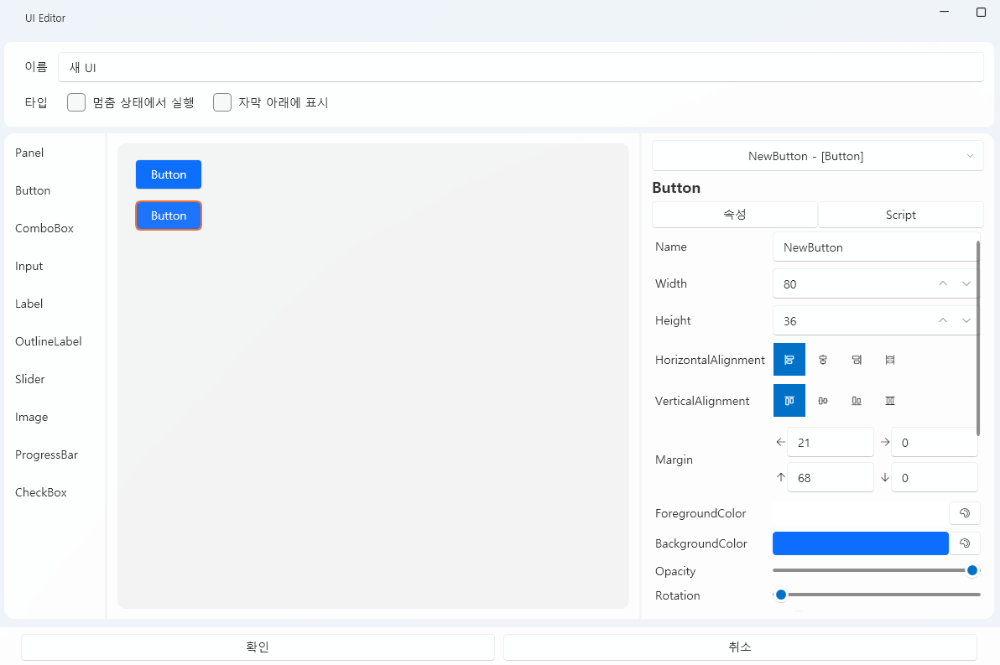
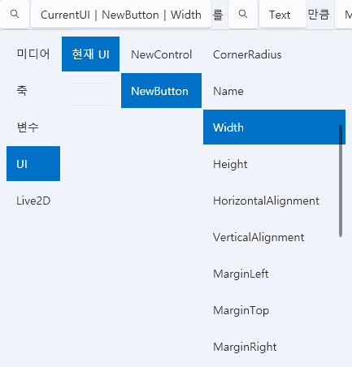

# UI 탭

UI 탭은 **프로젝트 내 인터페이스를 구성하고 제어**하는 편집 탭입니다.  
버튼, 이미지, 텍스트 등 다양한 UI 컨트롤을 배치하고  
각 요소에 스크립트를 연결하여 **상호작용을 구현할 수 있습니다.**

---

## 1. 기본 인터페이스

| 구성 요소 | 설명 |
|------------|------|
| **① 드래그하여 빈 UI 추가** | 새로운 **UI 인스턴스**를 생성합니다. |
| **② UI 템플릿** | 재사용 가능한 **UI 구성 템플릿**을 관리합니다. |
| **③ 가져오기** | 기존에 저장된 UI 템플릿을 불러옵니다. |
| **④ 새로 만들기** | 새 UI 템플릿을 생성합니다. |
| **⑤ 편집 ✏️** | 선택한 UI를 편집기로 엽니다. |
| **⑥ 삭제 🗑️** | 선택한 UI를 목록에서 제거합니다. |
| **⑦ 폴더 열기 📂** | `Asset/UI/` 폴더를 바로 엽니다. |

> 💡 **참고:**  
> UI 인스턴스는 독립적으로 동작하며,  
> UI 템플릿은 수정 시 모든 인스턴스에 동일하게 반영됩니다.

---

## 2. UI 템플릿과 인스턴스

UI는 **템플릿형**과 **인스턴스형**으로 구분됩니다.  
두 방식은 적용 범위와 수정 방식이 다릅니다.

| 구분 | 설명 | 특징 |
|------|------|------|
| **UI 템플릿** | 공용으로 재사용 가능한 UI 구성입니다. | 여러 화면에서 동일하게 사용 가능하며, 수정 시 일괄 반영됩니다. |
| **UI 인스턴스** | 개별 화면에만 적용되는 독립 UI입니다. | 각 인스턴스가 독립적으로 동작하며, 템플릿 변경의 영향을 받지 않습니다. |

> 💡 **예시:**  
> “선택지 UI”, “일시정지 메뉴”, “시작 화면” 등은 템플릿으로 저장하면 효율적입니다.  
> 특정 이벤트 전용 팝업 등은 인스턴스로 추가하는 것이 좋습니다.

---

## 3. UI 편집기

UI 편집기는 좌측의 컨트롤 목록에서 원하는 요소를 선택하여  
중앙의 캔버스에 배치하고, 우측 속성 패널에서 세부 설정을 조정하는 방식으로 구성되어 있습니다.

---

### 🎛️ 상단 옵션

| 항목 | 설명 |
|------|------|
| **이름(Name)** | UI의 이름을 지정합니다. |
| **멈춤 상태에서 실행** | 프로젝트가 일시정지 중일 때도 UI가 표시되고 동작합니다. |
| **자막 아래에 표시** | 자막보다 뒤쪽 레이어에 UI를 배치합니다. (HUD, 배경용 UI에 사용됩니다.) |

---

## 4. 컨트롤 목록

| 컨트롤 | 설명 |
|---------|------|
| **Panel** | 다른 컨트롤을 포함할 수 있는 기본 컨테이너입니다. |
| **Button** | 클릭 이벤트를 처리합니다. |
| **ComboBox** | 드롭다운 항목 중 하나를 선택할 수 있습니다. |
| **Input** | 텍스트를 입력할 수 있는 필드입니다. |
| **Label / OutlineLabel** | 텍스트를 표시하며, OutlineLabel은 외곽선이 있는 형태입니다. |
| **Slider / ProgressBar** | 값의 범위를 조정하거나 진행 상태를 표시합니다. |
| **Image** | 이미지 파일을 표시합니다. |
| **CheckBox** | ON/OFF 상태를 가지는 UI 요소입니다. |

> ⚙️ **참고:**  
> `Panel` 컨트롤만 자식 컨트롤을 포함할 수 있습니다.  
> 다른 컨트롤은 모두 단일 요소로 동작합니다.

---

## 5. 속성 편집

UI 컨트롤의 속성은 컨트롤 종류에 따라 다르지만,  
아래와 같은 **공통 속성**은 대부분의 컨트롤이 공유합니다.

| 항목 | 설명 |
|------|------|
| **Name** | 컨트롤의 고유 이름으로, 스크립트나 트리거에서 참조됩니다. |
| **Width / Height** | 컨트롤의 크기를 지정합니다. |
| **Horizontal / Vertical Alignment** | 부모 컨테이너 기준으로 정렬 위치를 지정합니다. |
| **Margin** | 부모 영역과의 여백을 설정합니다. |
| **Foreground / Background Color** | 전경색과 배경색을 지정합니다. |
| **Opacity / Rotation / Scale** | 투명도, 회전 각도, 크기를 조정합니다. |
| **IsEnabled / IsVisible** | 활성화 및 표시 여부를 제어합니다. |

> 💡 **참고:**  
> 컨트롤에 따라 **추가 속성**이 존재할 수 있습니다.  
> 예: `Text`, `FontSize`, `ImageSource`, `MaxValue` 등

---

## 6. 스크립트 이벤트

UI 컨트롤은 각자의 동작에 따라 **이벤트를 트리거**할 수 있으며,  
오른쪽의 `Script` 탭을 통해 스크립트를 연결할 수 있습니다.

---

### 🧩 공통 이벤트 (모든 컨트롤)

| 이벤트 | 설명 |
|--------|------|
| **MouseDown / MouseUp** | 마우스를 클릭하거나 해제할 때 실행됩니다. |
| **MouseEnter / MouseLeave** | 마우스가 영역에 진입하거나 이탈할 때 실행됩니다. |

> 💡 **특수 이벤트:**  
> 메인 `Panel`은 **Tick** 이벤트를 가집니다.  
> 해당 UI가 열려 있는 동안 매 프레임마다 호출되며,  
> 실시간 업데이트나 애니메이션 제어에 사용할 수 있습니다.  

---

### 🎛️ 컨트롤별 고유 이벤트

| 컨트롤 | 이벤트 | 설명 |
|---------|--------|------|
| **Panel** | `Loaded` | 판넬이 표시 될 때 실행됩니다. |
| **Panel** | `Unloaded` | 판넬이 제거 될 때 실행됩니다. |
| **Button** | `Click` | 클릭 시 실행됩니다. |
| **Input** | `TextChanged` | 입력 텍스트가 변경될 때 실행됩니다. |
| **Slider / ComboBox / CheckBox** | `ValueChanged` | 값이 변경될 때 실행됩니다. |

> 💡 **참고:**  
> 각 이벤트는 별도의 스크립트를 연결할 수 있으며,  
> 연결된 이벤트는 런타임에서 자동으로 실행됩니다.

---

### 💡 UI 스크립트 제어

UI 컨트롤은 스크립트를 통해 직접 접근하고 조작할 수도 있습니다.  
스크립트 입력 시 **`현재 UI(CurrentUI)`** 라는 기본 변수가 자동으로 제공되어  
현재 열려 있는 UI와 그 내부의 컨트롤에 쉽게 접근할 수 있습니다.

> 💡 **예시:**  
> 버튼 클릭 시 `CurrentUI | NewButton | FontSize` 값을 변경하여  
> UI 내 특정 버튼의 글자 크기를 실시간으로 조정할 수 있습니다.  
> 이 방식을 이용하면 **텍스트 변경, 색상 변경, 상태 갱신 등**  
> 다양한 인터페이스 반응을 구현할 수 있습니다.

또한 스크립트를 이용해 **UI 템플릿을 직접 열거나 닫는 기능**도 지원합니다.

> 💡 **예시:**  
> `UI "새 UI" 를 식별자 "ASD" 로 엽니다.`  
> 와 같은 스크립트를 통해 지정한 UI 템플릿을 동적으로 표시할 수 있습니다.  
> 이를 활용하면 이벤트나 트리거를 통해  
> 상황에 따라 UI를 자동으로 전환하거나 팝업을 띄우는 등의 구성이 가능합니다.

---

## 7. 컨트롤 관리

컨트롤을 우클릭하면 다음과 같은 관리 메뉴가 표시됩니다.

| 메뉴 | 설명 |
|------|------|
| **잘라내기 / 복사 / 붙여넣기** | 컨트롤을 이동하거나 복제합니다. |
| **맨 앞으로 / 뒤로 보내기** | 겹쳐진 UI의 표시 순서를 조정합니다. |
| **삭제 (Delete)** | 선택된 컨트롤을 제거합니다. |

또한 오른쪽 상단의 **콤보박스**를 사용하면  
캔버스에서 직접 클릭하기 어려운 컨트롤을 쉽게 선택할 수 있습니다.

---

## 8. Panel과 레이아웃 시스템

`Panel`은 UI의 루트 컨테이너로,  
모든 자식 컨트롤의 **배치 기준**이 되는 핵심 요소입니다.

---

### 🧱 WPF 레이아웃 구조

UI의 배치는 **WPF 레이아웃 시스템**을 기반으로 동작합니다.  
절대 좌표가 아닌 **상대 정렬 및 여백(Margin)** 으로 구성되어 있으며,  
다양한 해상도에서도 일정한 위치와 비율을 유지할 수 있습니다.

| 개념 | 설명 |
|------|------|
| **Alignment** | 부모 기준으로 좌/우/중앙 정렬을 설정합니다. |
| **Margin** | 부모 컨테이너와의 거리(여백)를 지정합니다. |
| **Z-Order** | 컨트롤의 표시 우선순위를 설정합니다. |
| **Relative Layout** | 해상도 비율에 따라 자동 조정되는 상대 배치 시스템입니다. |

> 💡 **참고 자료:**  
> - [Microsoft Docs: WPF 레이아웃 개요](https://learn.microsoft.com/ko-kr/dotnet/desktop/wpf/advanced/layout?view=netframeworkdesktop-4.8)  
> - [WPF Panels 소개 (Grid, StackPanel, Canvas 등)](https://learn.microsoft.com/ko-kr/dotnet/desktop/wpf/controls/panels-overview?view=netframeworkdesktop-4.8)

> ⚙️ **팁:**  
> 처음 사용할 때는 `HorizontalAlignment`와 `VerticalAlignment`를  
> 왼쪽/상단 기준으로 설정하고 `Margin`으로 위치를 조정하면 쉽게 익숙해질 수 있습니다.

---

## 9. 파일 구조

| 항목 | 경로 |
|------|------|
| **UI 템플릿 데이터** | `Asset/UI/Templates/` |
| **UI 인스턴스 데이터** | `Asset/UI/Instances/` |
| **리소스 (이미지 등)** | `Asset/UI/Resources/` |
| **다국어 텍스트** | `Asset/Localization/` |

---

## 10. 관련 문서

- [Live2D 탭](live2d.md)  
- [스크립트 탭](script.md)  
- [타임라인 편집](timeline.md)
