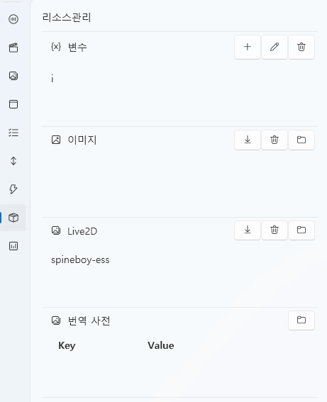

# Resource Management Tab

The **Resource Management Tab** provides a centralized space to **manage all global data resources used across a project**.  
Resources created or referenced in other tabs (UI, Script, Live2D, etc.) are collected here,  
where you can import, modify, or delete them.

> 💡 **Concept Summary:**  
> This tab serves as a **shared data hub**, connecting and storing resources generated in other editor tabs.

---

## 1. Interface Overview

| Component | Description |
|------------|-------------|
| **① Variables** | A list of **global variables** referenced throughout the project. |
| **② Images** | A list of **image resources** used in UI layouts or backgrounds. |
| **③ Live2D / Spine** | Manage Live2D and Spine animation models. |
| **④ Translation Dictionary** | Stores translation results and applies Key → Value mapping rules for post-translation adjustments. |

Each item can be **added (➕)**, **edited (✏️)**, or **deleted (🗑️)** individually.  
You can also **import (➕)** files from your local system into the project.

---

## 2. Variables

| Item | Description |
|------|--------------|
| **Purpose** | Manage **global variables** that can be referenced throughout the project. |
| **Add/Edit** | Define the variable name and initial value to create or update it. |
| **Usage Example** | Used in script conditions, UI bindings, or text replacement. |

> 💡 **Example:**  
> Define a variable `i`, and reference it within scripts using `[i]`.

---

## 3. Images

| Item | Description |
|------|--------------|
| **Purpose** | Manage **image resources** such as buttons, icons, and backgrounds used in the UI tab. |
| **Format** | Supports common image formats such as PNG and JPG. |
| **Functions** | Add new images via the **import (➕)** button or remove them with **delete (🗑️)**. |

> 💡 **Note:**  
> Imported images are copied into the project folder.  
> Any UI element linked to these images will update automatically.

---

## 4. Live2D / Spine

| Item | Description |
|------|--------------|
| **Purpose** | Manage Live2D and Spine models, and preview them directly. |
| **Supported Formats** | `.model3.json` (Live2D), `.skel` / `.json` (Spine) |
| **Functions** | Add new models using **import (➕)** or remove them with **delete (🗑️)**. |
| **Example** | Models such as `spineboy-ess` can be used within UI or scripts. |

> 💡 **Tip:**  
> Model resources can be **linked directly with motion playback** in the Stroke or Live2D tabs.

---

## 5. Translation Dictionary

| Item | Description |
|------|--------------|
| **Purpose** | Adjust translated text by replacing words for **post-translation refinement**. |
| **Structure** | Keys represent the original translated words; Values represent corrected expressions. |
| **Application** | Automatically replaces each Key with its Value after translation. |
| **Functions** | Add entries directly to the list or open (📂) the JSON file for manual editing. |

---

### 💡 Example — Post-Translation Word Correction

| Key | Value |
|-----|--------|
| Flower | Hana |
| Brother | Oppa |
| You | Darling |
| I | Me |
| Thee | You |

---

### 💬 Explanation

Automatic translation engines cannot always capture nuances such as emotional tone or relationship context.  
The Translation Dictionary allows you to **automatically correct specific words** after translation for more natural phrasing.

#### 🪷 Example 1 — Character named “Hana (花)”
Original: 私の名前は花。  
Machine Translation: My name is Flower.  
After Dictionary: My name is Hana.

#### 💞 Example 2 — “Oppa” translated incorrectly as “Brother”
Original: オッパ  
Machine Translation: Brother  
After Dictionary: Oppa

> 💡 **Key Point:**  
> The Translation Dictionary is a **Post-Translation Dictionary** —  
> applied to the **translated result**, not the original text.

---

> ⚙️ **Notes:**  
> - Works on a **word basis**, not on full sentences.  
> - If a word appears multiple times, **all instances** are replaced.  
> - Automatically applied during the translation post-processing phase.  
> - Especially useful for standardizing names, titles, and honorifics.

---

## 6. Management Summary

| Icon | Function | Description |
|------|-----------|-------------|
| ➕ | **Add** | Create a new resource. |
| ✏️ | **Edit** | Modify the selected resource. |
| 🗑️ | **Delete** | Remove the resource from the list. |
| ⬇️ | **Import** | Import local files into the project. |
| 📂 | **Open Folder** | Open the folder containing the actual resource file. |

> 💡 **Tip:**  
> The import feature lets you easily add external files to your project.  
> All resources are automatically copied to internal paths.  
> However, moving or renaming files externally may break their links.

---

## 7. File Structure

| Item | Path |
|------|------|
| **Variables** | `Asset/Variable/` |
| **Images** | `Asset/Image/` |
| **Live2D / Spine** | `Asset/Live2D/` |
| **Translation Dictionary** | `Asset/Translate/` |

---

## 8. Related Documents

- [UI Tab](ui.md)
- [Live2D Tab](live2d.md)
- [Script Tab](script.md)
- [Stroke Tab](stroke.md)
