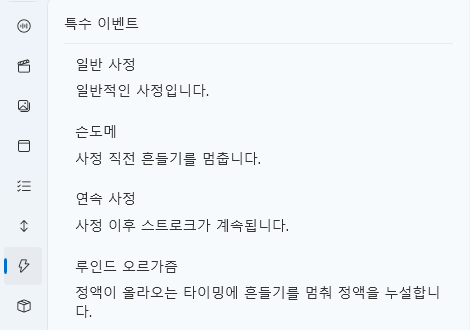

# Climax Tab

The **Climax Tab** manages **special trigger events** that occur during a climax or when certain conditions change.  
Currently, four fixed event types are available.  
Each event can be placed as a node on the timeline to control its trigger timing.

All events have **preset system behaviors** —  
users cannot customize or add new types of events.  
(However, timeline nodes can be individually edited or deleted.)

---

## 1. Event List

| Event | Description |
|--------|-------------|
| **Normal Climax** | The most basic climax event. Triggers at the moment of climax. |
| **Hand Stop** | Stops the stroke (device movement) right before climax. |
| **Continuous Climax** | Keeps the stroke running for a short time even after climax. |
| **Ruined Orgasm** | Stops the stroke just before climax to simulate a suppressed orgasm. |

> 💡 **Note:**  
> Each event has fixed system behavior.  
> You cannot edit the internal logic, but you can customize the hotkey and rest settings individually.

---

## 2. Event Editor

When a special event is placed on the timeline,  
you can double-click its node to open the **Event Options Window**.  
Here, you can configure trigger conditions and post-climax behavior.

---

### ⚙️ Settings

| Setting | Description |
|----------|-------------|
| **Climax Type** | Select one of the four special event types. |
| **Trigger Hotkey** | Assign a key to instantly trigger the event (e.g., LeftShift). |
| **Rest Stroke Position** | Define the device position after the event. Options: Top / Bottom / Keep Last Position. |
| **Rest Duration** | Set how long (in seconds) the device remains still after the event. |

---

### 💡 Event Flow

1. The user presses the assigned hotkey, triggering the event.  
2. The specified **special event action** is executed.  
3. The device remains stopped for the **set rest duration**.  
4. After the rest period, the next stroke pattern or event automatically resumes.

---

### 🧭 Summary

| Item | Description |
|------|-------------|
| **Number of Events** | 4 types (Normal Climax, Hand Stop, Continuous Climax, Ruined Orgasm) |
| **Configurable Options** | Hotkey, stroke position, rest duration |
| **Customizability** | Not available (system-defined) |
| **Timeline Integration** | Supported – events can be placed as nodes |

> ⚙️ **Tip:**  
> Special events can be combined with sound, stroke, and script elements  
> to create complex interactive sequences on the timeline.  
> For example, linking a “Hand Stop” event to a specific sound effect  
> can create a seamless, natural interactive flow.

---

## 3. Related Documents

- [Stroke Tab](stroke.md) — Defines stroke behavior  
- [Script](script.md) — Defines conditions and triggers  
- [Runtime Helper](runtime-helper.md) — Debugging and playback testing  
