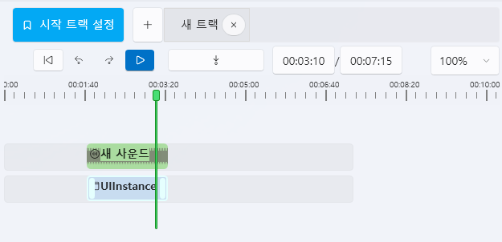

# Timeline Overview

The **Timeline** in VoiceScriptPlayer is the core system that manages playback intervals for **sound, video, Live2D, UI, and special events**.  
All resources are organized into **tracks**, and each track contains one or more **nodes** that define playback timing.

---

## 1. Basic Structure

The timeline consists of the following areas:

| Area | Description |
|------|-------------|
| **Track List** | Displays all tracks created in the current project. |
| **Add / Delete Track Buttons** | Use the `+ New Track` button to create new tracks. |
| **Start Track Setting** | Defines the base track that playback begins from when running the player. |
| **Playback Controls** | Includes ▶ Play / ⏸ Pause / ⏮ Rewind buttons. |
| **Time Ruler** | The upper ruler shows current time and total duration. |
| **Zoom** | Hold `Ctrl + Mouse Wheel` to zoom in or out of the timeline. |

---

## 2. Track Management

- Each track can contain **sound, video, Live2D, or UI events**.  
- You can **double-click the track name** to rename it.  
- Tracks can be **reordered** by dragging.  
- When you select a track, its **nodes appear on the timeline**.

> 💡 **Tip:**  
> For complex projects, organizing tracks by resource type  
> makes management and debugging much easier.

---

## 3. Nodes

Each playable resource unit on the timeline is called a **node**.  
Examples include an audio clip, a video section, or a Live2D motion.

| Action | Description |
|--------|-------------|
| **Drag to Add** | Drag resources from the left panel onto the timeline. |
| **Move Position** | Drag nodes to adjust their start times. |
| **Resize** | Drag the edges to extend or shorten the playback duration. |
| **Copy / Paste** | Use `Ctrl + C` and `Ctrl + V` to duplicate nodes. |
| **Delete** | Use the `Delete` key or right-click menu to remove nodes. |

---

## 4. Node Editing

Right-clicking a node opens a context menu with various editing options:

| Menu | Description |
|------|-------------|
| **Edit Condition** | Makes the node play only when certain conditions (variables or triggers) are met. |
| **Edit Time** | Set the exact start and end times manually. |
| **Copy / Paste** | Duplicate nodes to other tracks or time positions. |

> ⚙️ **Example Conditions:**  
> - Only play when variable `Flag_A` is active.  
> - Trigger when a specific event (e.g., a choice result) is true.  
> - Prevent repeated playback, etc.

---

## 5. Time Selection and Range Editing

You can **drag across the time ruler** to select a range on the timeline.  
This allows bulk editing across all tracks.

### 🔹 Selecting a Range
- Drag along the time ruler; the selected range will appear in green.  
- The selected range applies to all tracks simultaneously (sound, Live2D, events, etc.).

---

### 🔹 Right-Click Menu

Right-clicking within the selected range displays the following options:

| Menu | Description |
|------|-------------|
| **Insert Time** | Inserts time into the selected range and shifts all subsequent nodes forward. |
| **Delete Range** | Deletes the selected section and shifts later nodes backward. |
| **Keep Only Range** | Removes all content outside the selected range. |

> ⚙️ **Example:**  
> Selecting 3–6 minutes and choosing “Keep Only Range”  
> keeps only that segment, resetting the timeline from 0 seconds.

---

### 🔹 Usage Tips

- Useful for **previewing specific scenes** in long projects.  
- Helps **remove unnecessary empty spaces**.  
- “Insert Time” is convenient for adding quick gaps between events.  

> 💡 **Tip:**  
> Range selection works on a **time-based level**,  
> allowing you to rearrange large sections without touching individual nodes.

---

## 6. Time Controls

The **time controller** at the top of the timeline lets you directly manipulate playback position and duration.

| Function | Description |
|-----------|-------------|
| **Current Time** | Manually input or drag the slider to change the playback position. |
| **Total Duration** | Sets the overall length of the timeline. |
| **Zoom** | Use `Ctrl + Mouse Wheel` to zoom in/out. |
| **Play / Pause / Loop** | Plays or previews with the same logic as the main player. |

---

## 7. Node Condition System

The VoiceScriptPlayer timeline doesn’t just follow playback order —  
it also supports **logical conditions (Conditions)** to control node activation.

These conditions work in sync with variables and triggers defined in the **Script Tab**.

---

## 8. Preview and Synchronization

- Press ▶ at the bottom to preview all tracks.  
- During preview, sound, Live2D, and UI operate together,  
  simulating **the exact same behavior as in the actual player**.  
- To test specific parts, set the **Start Track** accordingly.

> 💡 **Tip:**  
> When dealing with complex multi-track setups,  
> use the **Condition Editor** to test different branching scenarios easily.

---

## 9. Related Documents

- [Sound Editing](sound.md) — Audio files, subtitle generation, track composition  
- [Script](script.md) — Condition variables and triggers  
- [Special Events](special-event.md) — Timing-based actions and effects  
- [Runtime Helper](runtime-helper.md) — Debugging and playback testing  
