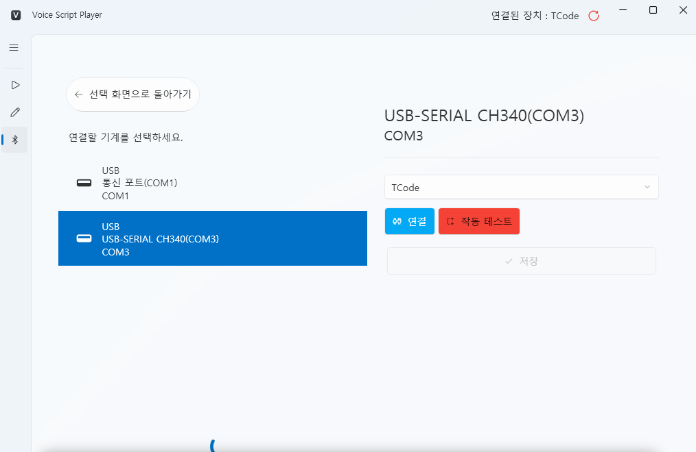

# TCode デバイス接続（Serial Device Setup）

## 1. 概要（Overview）
**VoiceScriptPlayer** は **TCode プロトコル** を使用して、  
USB またはシリアル（Serial）通信デバイスと直接接続できます。  
これは Intiface を介さずに、プログラムとデバイスが**直接通信**する方式です。

TCode 接続は主に以下のデバイスで使用されます：
- **USB-Serial ベースの DIY デバイス（例：OSR2、SR6 など）**  
- **Arduino / ESP32 ベースの TCode コントローラ**  
- **CH340、CP210x、FTDI などの一般的な USB-Serial チップセット**

---

## 2. 接続手順（Connection Steps）

### 🖱️ ステップ1 — 接続方式の選択
VoiceScriptPlayer を起動し、左メニューから「デバイス接続」をクリックします。  
「接続方式を選択してください」画面で **直接接続（Direct Connection）** を選択します。

> 💡 左から順に  
> `接続しない`、`直接接続`、`Intiface Central` ボタンがあります。  
> TCode を使用する場合は、2 番目の **直接接続** を選択してください。

---

### 🔌 ステップ2 — 接続するデバイスの選択
次の画面で、利用可能な **COM ポート一覧** が表示されます。

USB 接続の場合は、デバイスを挿すとすぐにポートが表示されますが、  
🔵 **Bluetooth 接続の場合は、デバイス名が表示されるまで 5～10 秒ほどかかる場合があります。**  
最初は「標準 Bluetooth シリアルリンク（COMx）」のように表示されます。

📷 **初回表示例：**  

しばらくすると Bluetooth デバイスが認識され、実際の名前（例：`FUNSR1-15877`）が表示されます。

📷 **認識後の表示例：**  

> ⏳ Bluetooth 接続はポート初期化のため、少し時間がかかる場合があります。  
> 名前が変わらない場合は、デバイスがペアリングされているか確認し、  
> 一覧を再読み込みしてください。

---

### ⚙️ ステップ3 — 接続設定の指定
右側のパネルで **プロトコル種別** を `TCode` に設定し、  
次に **[接続]** ボタンを押してポートを開きます。

接続が成功すると、「動作テスト」ボタンが有効になります。

---

### 🔁 ステップ4 — 動作テスト
**[動作テスト]** ボタンを押すと、デバイスが軽く動作し、接続状態を確認できます。  
テストが正常に完了すると **[保存]** ボタンが有効になります。  
デバイスが 3〜4 回上下に動作することを確認してください。  
誤ったポートに接続しても **[保存]** が有効になることがありますので注意してください。

> ✅ 保存を押すと、現在の接続がデフォルトデバイスとして設定されます。  
> 次回以降は自動的にこの設定でデバイスに接続されます。

---

### 🟢 ステップ5 — 接続状態の確認
すべての設定が完了すると、  
画面右上に `接続中のデバイス: TCode` と表示され、  
選択中の接続方式アイコンに **緑色の枠線** が付きます。

> 💡 枠線が緑色であれば、正常に動作中です。  
> イベントやスクリプトからの TCode コマンドが即時に送信されます。

---

## 3. 接続後の動作（Operation）
- 接続が維持されている間、すべての **TCode イベント** と **Stroke パターン** がリアルタイムで送信されます。  
- 接続が切断されると、画面上部の状態表示が灰色に変わります。  
- 保存されたポートは次回起動時に自動的に復元されます。

---

## 4. トラブルシューティング（Troubleshooting）

| 問題 | 原因 | 解決方法 |
|------|------|-----------|
| デバイスが一覧に表示されない | ドライバーが未インストール | デバイスマネージャーでポートドライバーをインストールする |
| 接続に失敗する | ポートが使用中 | 他のプログラム（Intiface など）が同じポートを使用していないか確認する |
| 動作テストに反応しない | ボーレート不一致または TCode 非対応 | デバイスのファームウェア設定を確認する |
| 接続後すぐに切断される | ケーブル不良またはポート電力不足 | 別の USB ポートに接続するか、外部電源付きハブを使用する |

---

## 5. 注意事項（Notes）
- 同じデバイスを Intiface Central でも使用する場合、  
  ポートの競合を避けるため、**同時に起動しないでください**。
