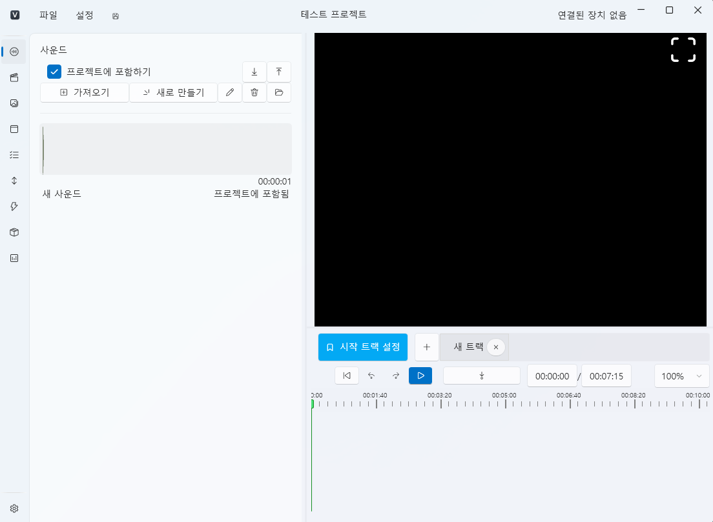

# エディター概要

**VoiceScriptPlayer エディター（Editor）** は、プロジェクトを構築し、リソースを編集するための中核ツールです。  
このページでは、エディター全体のインターフェース構成と各タブの役割を紹介します。

---

## 1. エディターの起動

プロジェクトを新規作成または読み込むと、自動的にエディターが開きます。  
エディターはいくつかの編集タブで構成されており、  
それぞれのタブは異なるリソース（サウンド、ビデオ、Live2D など）を管理します。

> 💡 **ヒント：**  
> VoiceScriptPlayer では、同時に 1 つのプロジェクトのみ開くことができます。  
> 新しいプロジェクトを開く場合は、現在のエディターを閉じてホーム画面に戻ってください。

---

## 2. インターフェース構成

VoiceScriptPlayer エディターは、**左側のリソースリスト**、**中央のプレイヤー（プレビュー）**、  
**下部のトラックおよび再生コントロールエリア**で構成されています。

| 領域 | 説明 |
|------|------|
| **上部メニューバー** | **ファイル**、**設定** などの基本メニューがあり、プロジェクトの保存・公開や環境設定を行います。 |
| **左パネル（リソースリスト）** | 現在のタブのリソース（例：サウンド、ビデオ、Live2D など）が表示されます。 新しいリソースの追加や削除が可能です。 |
| **中央エリア（プレイヤー）** | 選択したサウンド、ビデオ、または Live2D モデルがリアルタイムで再生される **プレビュー画面** です。 サイズ変更や全画面表示も可能です。 |
| **下部エリア（トラック / タイムライン）** | サウンドやイベントの時間軸を表示し、**再生区間や開始トラックを設定** できます。 再生・一時停止・ループなどのコントロールボタンもここにあります。 |
| **プロジェクト情報バー** | 上部中央には、現在のプロジェクト名や読み込まれた DLsite 作品名が表示されます。 |
| **ステータスバー（右上）** | 接続されているデバイスの状態（例：TCode、Intiface）を表示し、「接続デバイスなし」などの状態を確認できます。 |

---

### 🎮 主な要素の説明

- **プレイヤーエリア**  
  ビデオ、Live2D、UI 要素などがすべてこの領域に表示され、  
  実際のゲームのように **同期されたプレビュー** が可能です。  
  ビデオ再生、Live2D アニメーション、UI インタラクションがリアルタイムで反映されます。

- **トラック設定**  
  下部のタイムラインでは、トラックの追加や開始位置の設定ができます。  
  「開始トラックを設定」ボタンを押すと、そのトラックがプロジェクトの開始ポイントになります。

- **リソースリスト**  
  左側には、現在のタブに対応するリソースが一覧表示されます。

> 💡 **ヒント：**  
> サウンドタブとビデオタブの構造は同じです。  
> 「リソースリスト → プレビュー → トラック設定」の流れを覚えると、  
> 他のタブでも同じ手順で編集ができます。

---

## 3. 編集タブの構成

VoiceScriptPlayer のエディターは、以下のタブで構成されています。

| タブ名 | 説明 |
|--------|------|
| 🎵 [**サウンド**](../editor/sound.md) | 音声ファイル（`.mp3`, `.wav`）を読み込み、**字幕生成・編集**、**翻訳**、**音声合成 (TTS)** を行います。 |
| 🎬 [**ビデオ**](../editor/video.md) | 映像ファイル（`.mp4`, `.mov`）を追加し、**字幕生成**、**翻訳**、**同期編集** が可能です。 |
| 🧍 [**Live2D**](../editor/live2d.md) | キャラクターモデル（`.model3.json`）やモーションファイルを読み込み、配置と設定を行います。 |
| 🧩 [**UI**](../editor/ui.md) | ボタン、画像、テキストなどの **ユーザーインターフェイス要素** を配置・編集します。 |
| 💬 [**スクリプト**](../editor/script.md) | **変数、トリガー、条件文** を使用して、インタラクションの動作を定義・制御します。 |
| ✏️ [**ストローク**](../editor/stroke.md) | **タイムラインベースのストロークパターン** を読み込み、編集します。 |
| ✨ [**特殊イベント**](../editor/special-event.md) | **事前定義された特殊イベント** を設定できます。 |
| 📦 [**リソース管理**](../editor/resources.md) | プロジェクト全体で使用される **共通リソース（変数、画像、Live2D、翻訳辞書など）** を一括管理します。 |
| 🧰 [**ランタイムヘルパー**](../editor/runtime-helper.md) | プロジェクトのテスト中にデバッグ情報を表示します。 |

---

## 4. 基本的な編集フロー

VoiceScriptPlayer の編集プロセスは、**サウンドトラックを中心にすべての要素を同期** する構造になっています。  
以下の手順で作業を進めると、自然な流れでプロジェクトを完成させることができます。

---

<ol>
  <li>🎵 <b>サウンドタブでトラックを構成する</b> 
  音声や BGM ファイル（<code>.wav</code>, <code>.mp3</code>）を読み込みます。 
  必要に応じて <b>字幕生成（STT）</b> 機能を使用して音声をテキスト化します。 
  区間を分割したり、不要な部分を削除して整理します。</li>

  <li>🎬 <b>ビデオまたは Live2D タブでシーンを同期する</b> 
  ビデオや Live2D モデルを読み込み、<b>サウンドのタイミングに合わせます。</b> 
  Live2D のモーション、表情、アニメーションを音声に合わせて調整します。 
  ビデオの場合は字幕を追加したり、自動翻訳も可能です。</li>

  <li>🧩 <b>UI タブでインターフェイスを構築する</b> 
  ボタン、テキスト、画像などのインタラクティブ要素を配置します。 
  各 UI 要素に <b>スクリプトイベント</b> を割り当てられます。 
  例：「ボタンをクリックして次のトラックへ進む」「選択肢を表示する」など。</li>

  <li>💬 <b>スクリプトタブでロジックを定義する</b> 
  変数、トリガー、条件文を使って <b>プロジェクトの動作フロー</b> を設計します。 
  例：特定の区間が終了したら Live2D アニメーションを再生、音声を切り替え、など。 
  UI、ストローク、サウンド間の連携を一括で制御できます。</li>

  <li>✏️ <b>ストローク / 特殊イベントタブで物理効果を同期する</b> 
  ストロークエディターを使って <b>動作パターンやタイミング</b> を設定します。 
  特殊イベントタブではクライマックス演出などを構築できます。 
  サウンドトラックと同じ時間軸を共有しているため、精密な同期が可能です。</li>

  <li>▶️ <b>全体プレビューとデバッグ</b> 
  下部の再生ボタン ▶ を押して全体のシーケンスを確認します。 
  プレビュー中は <b>ランタイムヘルパー</b> でイベントや変数を確認します。</li>
</ol>

---

> 💡 **ヒント：**  
> タイムラインを変更した場合のみ保存が必要です。  
> リソースの追加や編集は自動的に反映され、手動での保存は不要です。

---

## 5. 主なショートカットキー

| ショートカット | 機能 |
|----------------|------|
| **Ctrl + S** | 現在のプロジェクトを保存 |

---

## 6. エディター設定と初期化

- **プログラム設定（Settings）**  
  上部メニューの **設定 → プログラム設定** から、  
  UI テーマ、言語、マイク設定、AI 設定、ショートカットなどを変更できます。

---

## 7. 次のステップ

VoiceScriptPlayer のすべての編集は **タイムライン（トラック）** を中心に行われます。  
サウンド、ビデオ、Live2D、UI、スクリプト、特殊イベントなどは  
すべてタイムラインの時間軸に沿って同期されます。

次のドキュメントでは、**トラックとタイムラインの構造** を理解し、  
その上にリソースを配置する方法を学びましょう。

---

### 🎞️ タイムラインとトラック構造
- [タイムライン概要](timeline.md)

---

### 🎵 各リソース別編集ガイド
タイムラインを理解した後、各リソースタブで詳細編集を行ってください。

- [サウンド編集](sound.md) – 音声ファイル、字幕生成（STT）、トラック構成  
- [ビデオ編集](video.md) – 映像再生、字幕同期、翻訳  
- [Live2D 編集](live2d.md) – キャラクターモデル、モーション、表情制御  
- [UI 編集](ui.md) – ボタン、テキスト、インターフェイス配置  
- [スクリプト編集](script.md) – トリガーと変数制御  
- [特殊イベント編集](special-event.md) – クライマックス演出、タイミング設定  
