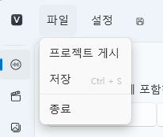

# プロジェクトの読み込みと保存

このドキュメントでは、**VoiceScriptPlayer** における  
プロジェクトの読み込み、保存、管理方法について説明します。

---

## 1. プロジェクトを読み込む

既存のプロジェクトは、**メイン画面のプロジェクト一覧（タイル形式）** から読み込むことができます。  
エディターが起動中のときは新しいプロジェクトを開けません。  
まずエディターを閉じて、ホーム画面に戻ってください。

---

### 🔹 読み込み手順

1. エディターウィンドウを閉じ、**ホーム画面** に戻ります。  
2. ホーム画面の **プロジェクト一覧（タイル）** から、開きたいプロジェクトを探します。  
3. 該当プロジェクトの **編集ボタンをクリック** すると、自動的に開きます。  
4. 最近編集したプロジェクトは、上部の **「最近編集したリスト」** にも表示されます。

> ⚠️ **注意:**  
> VoiceScriptPlayer は複数のプロジェクトを同時に開くことはできません。  
> 現在編集中のプロジェクトを閉じてから、別のプロジェクトを開いてください。

> 💡 **ヒント:**  
> プロジェクトは自動的に保存され、手動で削除しない限り一覧に残ります。  
> タイトル、タグ、説明はホーム画面で直接編集できます。

---

## 2. プロジェクトの保存

VoiceScriptPlayer では、作業中いつでも保存が可能で、  
自動保存機能もサポートしています。

| 保存方法 | 説明 |
|-----------|------|
| **保存 (Ctrl + S)** | 現在のプロジェクト状態を即時に保存します。 |

> 💡 **ヒント:**  
> リソースファイルは、プロジェクトの保存操作とは独立して反映されます。

---

## 3. リソース管理

VoiceScriptPlayer では、リソースを「エクスプローラー」形式で一括管理するのではなく、  
各リソースタイプごとに **専用のタブ** で個別に管理します。

---

### 🔹 リソースタブの構成

プロジェクト上部には、以下のようなリソース管理タブがあります。

| タブ名 | 説明 |
|--------|------|
| 🎵 [**サウンド**](../editor/sound.md) | オーディオファイル（`.mp3`, `.wav`）を読み込み、**字幕生成・編集**、**翻訳**、**音声合成（TTS）** を行えます。 |
| 🎬 [**ビデオ**](../editor/video.md) | 動画ファイル（`.mp4`, `.mov`）を追加し、**字幕生成**、**翻訳**、**同期編集** を行えます。 |
| 🧍 [**Live2D**](../editor/live2d.md) | キャラクターモデル（`.model3.json`）やモーションファイルを読み込み、配置・設定します。 |
| 🧩 [**UI**](../editor/ui.md) | ボタン、画像、テキストなど **ユーザーインターフェース要素の配置と編集** を行います。 |
| 💬 [**スクリプト**](../editor/script.md) | **変数、トリガー、条件式** を使ってインタラクティブな動作を定義・制御します。 |
| ✏️ [**ストローク**](../editor/stroke.md) | **タイムラインベースのストロークパターン** を読み込み、設定します。 |
| ✨ [**スペシャルイベント**](../editor/special-event.md) | **あらかじめ定義された特殊イベント** を提供します。 |
| 📦 [**リソース管理**](../editor/resources.md) | プロジェクト全体で使用される **共通リソース（変数、画像、Live2D、翻訳辞書など）** を一括管理します。 |

---

### 🔹 リソースの追加方法

1. 目的のリソースタブ（例：**サウンド**、**ビデオ**、**Live2D**）に移動します。  
2. 上部の **[インポート] ボタン** をクリックしてファイルを読み込みます。  
3. リソースがそのタブのリストに登録され、プロジェクトフォルダ内の適切な場所に自動コピーされます。

> ⚙️ **補足:**  
> リソースはそれぞれのタブで独立して管理されます。  
> 追加したファイルは自動的に `Video/`, `UI/`, `Trigger/` などのフォルダに整理され、  
> パスを手動で指定する必要はありません。

---

### 🔹 リソースの編集・削除

- 各タブで登録済みのリソースを選択すると、**右側のパネル** に詳細設定が表示されます。  
- 設定を変更するとリアルタイムで反映され、手動保存なしで自動的に保存されます。  
- 不要なリソースは **[削除] ボタン** で削除できます。  
  （該当ファイルはプロジェクトフォルダ内からも自動的に整理されます。）

---

> 💡 **ヒント:**  
> 各リソースタブは独立して動作するため、  
> 一方のリソースを編集しても他のタブには影響しません。  
> たとえば、サウンドを編集中でも UI タブのボタン配置はそのまま保持されます。

---

## 4. エクスポートと共有

VoiceScriptPlayer では、プロジェクトを他のユーザーに配布したり、  
編集不可の **再生専用形式** で公開することができます。

---

### 📁 プロジェクト公開を開く

プロジェクト公開機能は、上部メニューの **[ファイル → プロジェクト公開]** から実行できます。  
この項目をクリックすると、公開設定ウィンドウが開きます。

---

### 🗂️ 公開設定ウィンドウ

公開ウィンドウでは、次の項目を設定できます。

| 項目 | 説明 |
|------|------|
| **出力先を選択** | 公開するフォルダのパスを選択します。 |
| **プロジェクトに含めるリソース** | 公開時に含めるリソースを選択します。 右矢印（→）で除外、左矢印（←）で追加できます。 |

公開が完了すると、選択したフォルダ内に  
**編集不可・再生専用のプロジェクトフォルダ** が生成されます。

> ⚙️ **補足:**  
> 公開時にプロジェクトは圧縮されません。  
> 内部構造（`Video/`, `UI/`, `Trigger/` など）はそのまま保持され、  
> **VoiceScriptPlayer Player** でのみ実行可能です。

---

### 🎧 著作権付き音源の除外

公開時に、著作権に関わるオーディオファイル（商用BGMやボイスなど）は  
「プロジェクトに含めるリソース」リストから除外できます。

- 除外された音源は公開フォルダにコピーされません。  
- 再生時にユーザーが手動で該当ファイルの位置を指定できます。  
- これにより、**著作権を保護しながらプロジェクトを配布** できます。

> 💡 **ヒント:**  
> 公開前に著作権関連のリソースを整理しておくと、  
> 他のユーザーがプロジェクトを開いたときにエラーなく再生できます。

---

### 📦 エクスポートオプションのまとめ

| 機能 | 説明 |
|------|------|
| **プロジェクト公開** | フォルダ形式で出力。編集不可・再生専用。 |
| **プロジェクトのエクスポート** | プロジェクト全体をコピー（またはバックアップ）。 |
| **プレイヤービルドのエクスポート** | 実行ファイルとしてビルドし、完全なスタンドアロン再生が可能。 |

---

## 5. バックアップとバージョン管理

プロジェクトの安定性を保つため、定期的なバックアップとバージョン管理を推奨します。

- **推奨フォルダ:**  
  `Documents/VoiceScriptPlayer/Projects/` フォルダ内に  
  各プロジェクトを個別フォルダとして整理してください。

---

## 6. 次のステップ

- [エディターの概要](../editor/overview.md)
