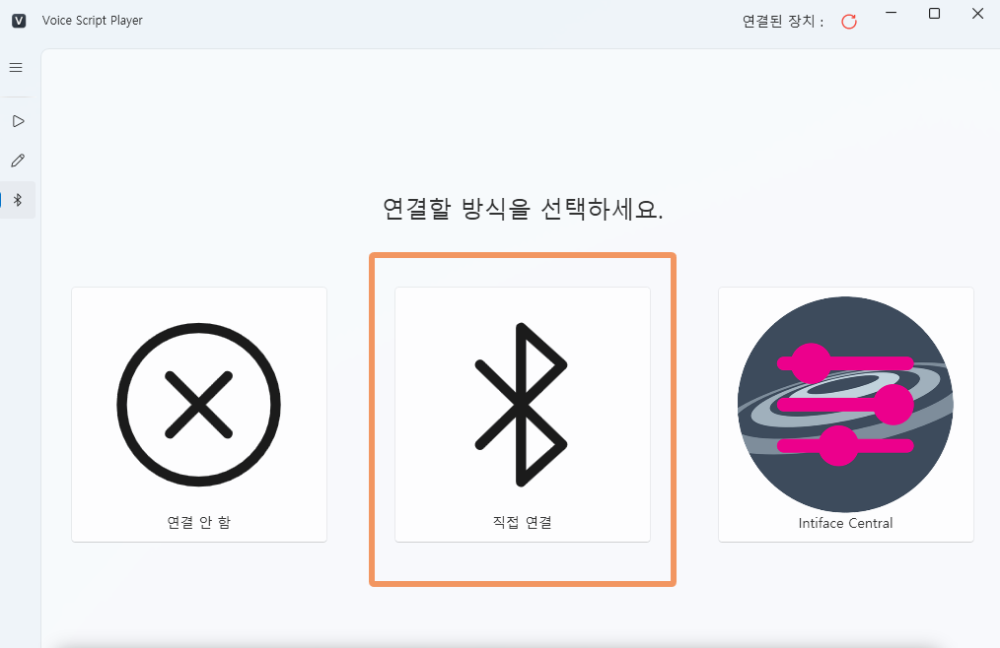

# TCode 장치 연결 (Serial Device Setup)

## 1. 개요 (Overview)
VoiceScriptPlayer는 **TCode 프로토콜**을 이용해  
USB 또는 직렬(Serial) 통신 장치와 직접 연결할 수 있습니다.  
이는 Intiface를 거치지 않고, 장치와 프로그램이 **직접 통신**하는 방식입니다.

TCode 연결은 주로 다음과 같은 장치에 사용됩니다:
- **USB-Serial 기반 DIY 장치 (예: OSR2, SR6 등)**
- **Arduino / ESP32 기반 TCode 컨트롤러**
- **CH340, CP210x, FTDI 등 일반적인 USB-Serial 칩셋**

---

## 2. 연결 과정 (Connection Steps)

### 🖱️ 1단계 — 연결 방식 선택
VoiceScriptPlayer를 실행하고, 왼쪽 메뉴에서 기기 연결을 클릭합니다.  
**“연결할 방식을 선택하세요.”** 화면에서 **직접 연결(Direct Connection)** 을 선택합니다.

> 💡 왼쪽부터 순서대로  
> `연결 안 함`, `직접 연결`, `Intiface Central` 버튼이 있습니다.  
> TCode는 두 번째 **직접 연결**을 선택해야 합니다.

---

### 🔌 2단계 — 연결할 장치 선택
다음 화면에서 연결 가능한 **COM 포트 목록**이 표시됩니다.

USB 연결의 경우 장치가 꽂히면 거의 즉시 포트가 표시되지만,  
🔵 **Bluetooth 연결의 경우에는 장치 이름이 나타나기까지 약 5~10초 정도의 시간이 걸릴 수 있습니다.**  
처음에는 아래와 같이 단순히 “표준 Bluetooth에서 직렬 링크(COMx)” 형태로 표시됩니다:

📷 **처음 표시 예시:**  

잠시 후 Bluetooth 장치가 인식되면 실제 기기 이름(예: `FUNSR1-15877`)이 표시됩니다:

📷 **이름이 표시된 후:**  

> ⏳ Bluetooth 연결은 포트 초기화 과정 때문에 잠시 지연될 수 있습니다.  
> 이름이 바뀌지 않으면 장치가 페어링되어 있는지 확인하거나,  
> 목록을 다시 열어 새로 고쳐보세요.

---

### ⚙️ 3단계 — 연결 설정 지정
오른쪽 패널에서 **프로토콜 종류**를 `TCode`로 설정합니다.  
그다음 **[연결]** 버튼을 눌러 포트를 엽니다.

연결에 성공하면 “작동 테스트” 버튼이 활성화됩니다.

---

### 🔁 4단계 — 작동 테스트
**[작동 테스트]** 버튼을 누르면 장치가 간단히 반응하여 연결 상태를 확인할 수 있습니다.  
테스트가 정상적으로 완료되면 **[저장]** 버튼이 활성화됩니다.  
기기가 정상적으로 3~4번 위아래로 움직이는지 확인하세요.  
잘못된 기기에 연결되도 **[저장]** 버튼이 활성화 될 수 있습니다.

> ✅ 저장을 누르면 현재 연결이 기본 장치로 설정됩니다.  
> 이후 설정이 저장되며 자동으로 기기에 연결됩니다.

---

### 🟢 5단계 — 연결 상태 확인
모든 설정이 완료되면,  
화면 오른쪽 상단에 `연결된 장치: TCode`가 표시되며  
선택한 연결 방식 아이콘에 **초록색 테두리**가 생깁니다.

> 💡 연결 상태가 초록색이면 정상 작동 중이며,  
> 이벤트와 스크립트에서 TCode 명령이 즉시 전송됩니다.

---

## 3. 연결 후 동작 (Operation)
- 연결이 유지된 동안 모든 **TCode 이벤트**와 **Stroke 패턴**이 실시간으로 전송됩니다.  
- 연결이 끊기면 프로그램 상단의 표시가 회색으로 변경됩니다.  
- 저장된 포트는 다음 실행 시 자동 복원됩니다.

---

## 4. 문제 해결 (Troubleshooting)
| 문제 | 원인 | 해결 방법 |
|------|------|-----------|
| 장치 목록에 표시되지 않음 | 드라이버 미설치 | 장치 관리자에서 포트 드라이버를 설치 |
| 연결 실패 | 포트 사용 중 | 다른 프로그램(Intiface 등)이 같은 포트를 점유 중인지 확인 |
| 작동 테스트 반응 없음 | Baudrate 불일치 또는 TCode 미지원 | 장치 펌웨어 설정 확인 |
| 연결 후 바로 끊김 | 케이블 불량 또는 포트 전력 부족 | 다른 USB 포트에 연결 또는 외부 허브 사용 |

---

## 5. 참고 (Notes)
- 동일 장치로 Intiface Central을 사용할 경우, 포트 충돌을 피하기 위해 한쪽만 실행해야 합니다.
