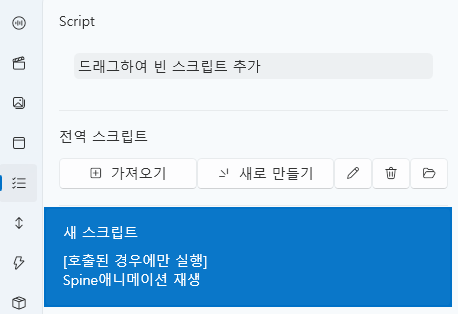

# 脚本标签（Script Tab）

**脚本标签** 是 **VoiceScriptPlayer 的核心逻辑系统**，  
用于通过 **条件（Condition）与动作（Action）** 控制项目中的所有事件、交互、动画、UI 与声音等。

---

## 1. 基本界面

| 组件 | 说明 |
|------|------|
| **① 拖拽添加脚本** | 创建新的实例脚本并添加到项目中。 |
| **② 全局脚本** | 管理始终加载的全局脚本。 |
| **③ 导入** | 载入现有的脚本模板。 |
| **④ 新建** | 创建新的脚本模板。 |
| **⑤ 编辑 ✏️** | 在编辑器中打开选定的脚本。 |
| **⑥ 删除 🗑️** | 从列表中移除所选脚本。 |
| **⑦ 打开文件夹 📂** | 直接打开 `Asset/Trigger/` 文件夹。 |

> 💡 **提示：**  
> 全局脚本默认始终存在，但可以通过“仅在被调用时执行”选项将其作为模板使用。

---

## 2. 脚本编辑器

脚本编辑器允许你自由组合 **条件块（Condition）** 与 **动作块（Action）**，  
以可视化方式构建复杂逻辑。

---

### 🧭 顶部面板

| 项目 | 说明 |
|------|------|
| **名称** | 指定脚本的唯一名称。 |
| **描述** | 记录脚本的用途或功能说明。 |
| **单次执行** | 仅执行一次，不会再次触发。 |
| **暂停时执行** | 即使在暂停状态下也可执行（用于菜单、设置界面等）。 |
| **仅在被调用时执行** | 仅在被外部触发或调用时执行。 |

---

### 🧩 局部变量

| 功能 | 说明 |
|------|------|
| **添加（＋）** | 在脚本中创建局部变量。 |
| **编辑（✏️）** | 修改变量名称或初始值。 |
| **删除（🗑️）** | 删除选中的变量。 |

> 💡 **注意：**  
> 局部变量仅在当前脚本中有效，不会与全局变量冲突。

---

## 3. 条件块（Condition）

条件块决定脚本 **是否执行**。  
你可以组合多个条件来构建 **精确的触发逻辑**。

---

### ⚙️ 基本概念

- 当所有条件为 **真（True）** 时，执行相连的 **动作块（Action）**。  
- 多个条件时，默认以 **AND（并且）** 逻辑计算。  
- 使用 **分支块（Branch）** 可根据条件结果设置不同执行路径。  
- 详情见 [条件列表](#10)。

---

### 🧩 示例

| 场景 | 条件示例 |
|------|----------|
| 键盘输入 | “当按下 [Space] 键时” |
| 语音识别 | “当识别到语音 ‘开始’ 时” |
| 变量判断 | “当变量 [Score] ≥ 100 时” |
| 字幕触发 | “当字幕包含 ‘Hello’ 时” |

> 💡 **提示：**  
> 条件可与 UI、声音、Live2D 等资源联动，例如：  
> “当前轨道为 1 且字幕包含指定文本” 等复合条件。

---

## 4. 动作块（Action）

动作块定义 **条件满足后执行的操作**，  
例如播放声音、修改变量、切换轨道、打开 UI 等。

---

### ⚙️ 基本概念

- 动作按 **自上而下** 顺序执行。  
- 可插入 **等待（Wait）** 动作以控制时间。  
- 结合循环可实现 **持续逻辑**。  
- 详情见 [动作列表](#11)。

---

### 🧩 示例

| 场景 | 动作示例 |
|------|----------|
| 播放声音 | “播放声音 [Voice01]。” |
| 切换轨道 | “切换到轨道 [NextScene]。” |
| 修改变量 | “变量 [Volume] 增加 10。” |
| 打开 UI | “打开 UI [OptionMenu]，标识符为 [Main]。” |
| 控制 Live2D | “在 [Scene01] 中播放动画 [smile]。” |

> 💡 **说明：**  
> 动作也可基于时间执行，例如：  
> “3 秒内增加变量”、“2 秒内渐变动画”等。

---

## 5. 分支块（Branch）

分支块用于区分 **条件为真** 与 **条件为假** 时的执行逻辑。

| 结构 | 说明 |
|------|------|
| **条件成立** | 当条件为 True 时执行。 |
| **条件不成立** | 当条件为 False 时执行。 |

> 💡 可嵌套多个分支以构建复杂事件逻辑。

---

## 6. 循环块（Loop）

循环块在条件为真时持续执行指定动作。

| 项目 | 说明 |
|------|------|
| **循环条件** | 根据变量或状态判断是否继续循环。 |

> 💡 常用于“按键持续时重复动作”或“等待字幕出现”等场景。

---

## 7. 条件与动作的组合

脚本由多个条件与动作组合而成。  
可拖拽调整顺序，并通过顶部图标实现复制、剪切或移动。

| 图标 | 功能 |
|------|------|
| ➕ | 新增条件或动作块 |
| 🔀 | 添加分支（If / Else） |
| 🔁 | 添加循环 |
| ✏️ | 编辑选定块 |
| ✂️ | 剪切 |
| 📋 | 复制 / 粘贴 |
| 🗑️ | 删除 |
| ⬆️ / ⬇️ | 调整顺序 |

> ⚙️ **提示：**  
> 脚本结构可随时修改，且支持实时调试。

---

## 8. 全局脚本与实例脚本

| 类型 | 说明 |
|------|------|
| **全局脚本** | 始终加载并在项目范围内生效。 |
| **实例脚本** | 绑定到特定轨道、UI 或事件上执行。 |

> 💡 **示例：**  
> - 全局脚本 → HUD 更新、计时事件  
> - 实例脚本 → 特定分支场景逻辑

---

## 9. 脚本执行模式

| 选项 | 说明 |
|------|------|
| **单次执行** | 条件满足后仅执行一次。 |
| **仅在被调用时执行** | 需由其他脚本或触发器调用。 |
| **暂停时执行** | 暂停状态下也可运行（如菜单）。 |
| **无限循环** | 条件为真时持续执行。 |

---

## 10. 条件列表

脚本执行的触发条件定义如下。

---

### 🖱️ 键盘输入

#### 🔹 KeyDown  
当按下 **[Key]** 时触发。  
- **Key**：键名（如 `A`、`Space`、`Enter`）

#### 🔹 KeyUp  
当 **[Key]** 释放时触发。  

#### 🔹 KeyPressed  
检测到按键按下（Down → Up）时触发。

---

### 🗣️ 语音 / 字幕

#### 🔹 SpeechRecognition  
当识别到语音 **[Text]** 且音量 ≥ **[Volume]**、精度 ≥ **[Precision]** 时触发。  
- **Volume**：最小音量 (0~1)  
- **Precision**：识别精度 (0~1)

#### 🔹 SubtitleRecognition  
当字幕包含 **[Text]** 时触发。

---

### 📊 状态 / 变量

#### 🔹 VariableComparison  
当变量 **[Variable]** 与 **[Value]** 满足 **[Comparison]** 条件时。  
- **Comparison**：`≥`、`≤`、`>`、`<`、`==`、`!=`

#### 🔹 CurrentTrack  
当前轨道为 **[Track]** 时触发。  

#### 🔹 CumAction  
当发生特定射精动作 **[CumType]** 时触发。  

#### 🔹 RestStatus  
休息状态为 **[Status]** 时触发。  

#### 🔹 EventStatus  
当事件 **[EventType]** 状态为 **[EventStatus]** 时触发。  

---

## 11. 动作列表

定义条件满足时执行的操作。

---

### ⏱️ 时间控制

#### 🔹 WaitTime  
等待 **[Seconds]** 秒。  

---

### 🔊 声音控制

#### 🔹 PlaySound  
播放声音 **[Sound]**，左右声道音量分别为 **[LeftVolume]**、**[RightVolume]**。  

---

### 📦 变量 / 轨道控制

#### 🔹 SetVariable  
修改变量 **[Variable]** 的值，方式为 **[Modify]**，持续 **[Seconds]** 秒。  

#### 🔹 MoveTrack  
切换到轨道 **[Track]**。  

#### 🔹 SeekTime  
将轨道时间跳转到 **[Seconds]** 秒。  

---

### 💾 数据管理

#### 🔹 Save / Load  
保存或加载到 **Slot:[Slot]**。  

#### 🔹 Close  
关闭程序。  

---

### 🧩 UI 控制

#### 🔹 OpenUI / CloseUI  
打开或关闭 UI **[UI]**，标识符为 **[Text]**。  

---

### 🔁 脚本控制

#### 🔹 TriggerExec / ReturnScript  
执行或返回脚本 **[Trigger]**。  

---

### 💦 动作 / 事件控制

#### 🔹 CumActionExec  
强制触发射精动作 **[CumType]**。  

#### 🔹 RestTime  
休息 **[Seconds]** 秒。  

#### 🔹 StrokeExec  
执行 **[Stroke]** 持续 **[Seconds]** 秒。  

---

### 🎬 Live2D / Spine 控制

#### 🔹 SpinePlayAnimation  
在 Live2D **[Live2D]** 的 Spine 模型 **[Model]** 上播放动画 **[Animation]**。  

#### 🔹 SpineSetSkin  
设置 Spine 模型 **[Model]** 的皮肤为 **[Skin]**。  

---

> ⚙️ **说明：**  
> 所有条件与动作均以可视化积木形式呈现。

---

## 12. 文件结构

| 项目 | 路径 |
|------|------|
| **全局脚本** | `Asset/Trigger/` |

> ⚠️ **注意：**  
> 脚本必须保存在项目内部，不能引用外部文件。

---

## 14. 相关文档

- [UI 标签](ui.md)  
- [Live2D 标签](live2d.md)  
- [时间线编辑](timeline.md)
