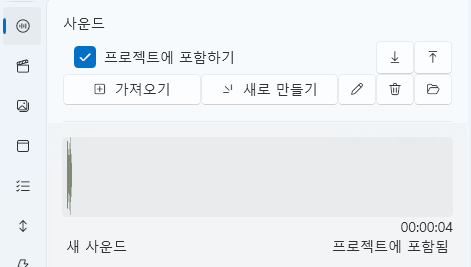
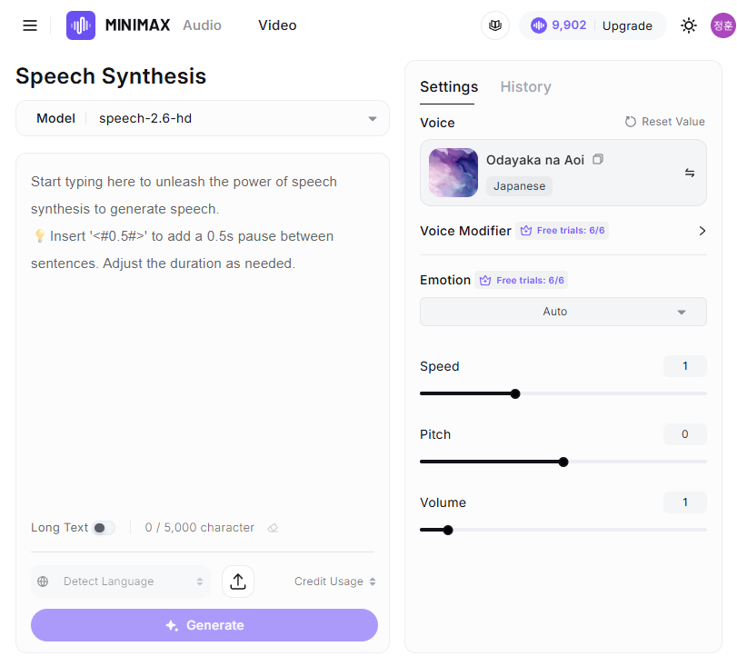

# 声音标签页（Sound Tab）

VoiceScriptPlayer 的 **声音标签页** 是用于管理项目中核心音频的编辑区域，  
同时执行字幕（STT）、翻译和语音合成（TTS）等功能。  
所有轨道和事件都以声音为基准进行同步。

---

## 1. 基本界面

声音标签页用于管理项目中使用的所有音频文件。  
TTS 生成、字幕设置、文件导入等所有与语音相关的功能都在此完成。

| 组件 | 说明 |
|------|------|
| **① 包含到项目中** | 勾选后，导入的音频会**复制到项目内部文件夹**中。 取消勾选则仅**引用外部文件**，不会复制实际音频。 |
| **② 导入** | 从本地磁盘导入 `.wav`、`.mp3` 文件。 是否复制取决于“包含到项目中”的状态。 |
| **③ 新建** | 创建新的 TTS 语音。 点击后打开 **TTS 生成窗口**，可通过指定的语音引擎（如 COEIROINK）合成输入台词。 |
| **④ 编辑 ✏️** | 打开所选音频的详细编辑窗口。 导入的音频显示为**字幕编辑器**，生成的 TTS 音频显示为 **TTS 编辑器**。 |
| **⑤ 删除 🗑️** | 从列表中移除选定的音频。 |
| **⑥ 导出 ↗ / 重新导入 ↙** | 将项目中包含的音频导出到外部文件夹，或重新导入到项目中。 |
| **⑦ 打开音频文件夹 📂** | 直接打开当前项目中**音频文件所在的文件夹**。 |
| **⑧ 波形预览区域** | 显示选定音频的波形与长度。下方显示文件名、播放时长及是否包含在项目中。 |

---

### ⚙️ 操作概要

| 情况 | 结果 |
|------|------|
| 勾选“包含到项目中”后导入 | 文件将**复制**到项目文件夹（`Asset/Sound/`）。 |
| 未勾选后导入 | 文件仅被**引用**，实际不会移动。 |
| 使用“导出到外部”按钮 | 将选定音频复制到指定文件夹。 |
| 使用“重新导入到项目”按钮 | 将外部文件恢复到项目中。 |

---

> 💡 **提示：**  
> 取消勾选“包含到项目中”有以下优点：
>
> - ✅ **减少项目体积：** 大型音频文件不会被复制，从而节省存储空间。  
> - ⚡ **加快加载速度：** 省略复制过程，导入更快。  
> - 🛠️ **易于外部编辑：** 外部编辑（如降噪、替换音频）能立即反映在项目中。  
> - 🧾 **保护版权：** 可避免将付费音源或商用语音包含在项目文件中。  
>
> 但请注意，这类引用音频在**发布导出**时不会自动包含，  
> 他人获取项目后将**无法播放未包含的音频文件**。

---

## 2. 字幕设置（Medio Editor）

选择音频文件并点击 **✏️ 编辑** 按钮后，  
将打开 `Medio Editor` 窗口，可同时执行字幕生成（STT）、翻译与时间调整。

---

### 🎛️ 基本组成

| 项目 | 说明 |
|------|------|
| **名称** | 当前正在编辑的音频文件名。 |
| **长度** | 显示音频的播放范围和总时长。 |
| **AI 设置** | 可直接打开 Whisper、DeepL 等 AI 引擎设置，无需关闭窗口。 |
| **音频语言** | 选择 STT 使用的语音语言（如日语、韩语、英语等）。 |
| **翻译语言** | 指定翻译的目标语言。 |
| **视频预览窗口** | 显示字幕预览效果。 |
| **字幕列表（右侧）** | 可单独修改每一行字幕的时间区间与位置。 |

---

### 🗣️ 将音频转换为字幕（STT）

1. 设置 **音频语言**。  
2. 点击 **[将音频转换为字幕]** 按钮。  
3. 使用已注册的 **STT 引擎**（如 Whisper）将语音转换为文本。  
4. 结果会自动显示为**分段字幕列表**。

| 项目 | 说明 |
|------|------|
| **StartTime / EndTime** | 调整字幕的开始与结束时间。 |
| **字幕内容** | 显示识别出的文本，可直接编辑。 |
| **X / Y** | 指定字幕在屏幕中的显示位置。 |
| **FontSize / OutlineSize** | 调整字幕的字体大小与描边粗细。 |
| **Dock** | 选择字幕基准位置（上、中、下）。 |
| **Fill / Outline** | 设置字幕颜色与描边颜色。 |

> 💡 **提示：**  
> 转换后的字幕会自动保存至项目的 `Asset/Sound/` 文件夹，  
> 可在其他音频或视频中复用。

---

### 🌐 字幕翻译

1. 生成字幕后点击 **[翻译字幕]** 按钮。  
2. 使用所选的 **翻译引擎**（DeepL、LibreTranslate 等）  
   自动将 `音频语言 → 翻译语言`。  
3. 翻译结果会与原文并排显示，可逐条修改。

| 选项 | 说明 |
|------|------|
| **自动翻译引擎** | 使用在设置中指定的翻译 API。 |
| **结果预览** | 在字幕预览窗口中即时查看翻译结果。 |
| **编辑应用** | 可直接在右侧面板中编辑并应用翻译结果。 |

> 💡 **提示：**  
> - 若要将日语音频翻译成韩语，请将 **音频语言=日语**、**翻译语言=韩语**。  
> - 翻译后的字幕与原字幕一同保存，播放音频时将自动显示。

---

### ▶️ 预览与确认

- 点击底部的 **播放按钮 ▶** 可检查字幕同步。  
- 可通过滑块查看特定时间段字幕。  

> ⚙️ **STT 与翻译引擎设置：**  
> - [AI → Whisper](../ai/whisper.md)  
> - [AI → DeepL](../ai/deepl.md)  
> - [AI → LibreTranslate](../ai/libretranslate.md)

---

### 📦 输出位置

| 类型 | 路径 |
|------|------|
| STT 字幕文件 | `Asset/Sound/原始文件名.srt` |

---

## 3. 语音合成（TTS）

点击 **[新建]** 按钮后，会打开 `Audio Editor` 窗口，  
可输入多句文本，并为每句单独设置合成参数。  
可使用 COEIROINK、Hailuo 等语音引擎，生成自然的语音片段。

---

### 🧩 主要更新摘要

| 项目 | 说明 |
|------|------|
| **多句输入支持** | 在一次编辑中可输入多句，每句单独合成。 |
| **句子级 TTS 设置** | 每句可独立调整角色、语速、音高、音量等参数。 |
| **新增时间轴** | 增加 TTS 专用时间轴，与其他轨道（视频、事件等）一致。 |
| **预览功能改进** | 可逐句播放或连续预览。 |

---

### 🎛️ 基本组成

| 项目 | 说明 |
|------|------|
| **名称** | 要生成的音频文件名称。 |
| **长度** | 显示当前句子集合的总播放时间。 |
| **AI 设置** | 打开所选 TTS 引擎的配置窗口。 |
| **TextToSpeech 引擎** | 选择所使用的引擎（如 `COEIROINK`、`Hailuo`）。 |
| **时间轴** | 句子在时间轴上排列，可调整长度与位置。 操作方式与视频、事件轨道相同。 |

---

### 🗣️ 句子级编辑

每句文本独立管理，可单独调整**文本、语音参数、字幕样式**。

| 项目 | 说明 |
|------|------|
| **文本输入框** | 输入要转换的台词。多行输入时每行为单独句子。 |
| **角色选择** | 指定使用的语音角色（如 リリン酱、ノエル 等）。 |
| **速度 / 音高 / 强度 / 音量** | 每句可单独调整。 |
| **字幕预览** | 下方显示字幕以检查同步。 |
| **字幕设置** | 独立设置字幕位置、字体大小、颜色、描边等视觉属性。 |

---

### 📜 时间轴控制

新增的 **TTS 时间轴** 与其他轨道编辑方式一致。

| 项目 | 说明 |
|------|------|
| **句子节点** | 每句显示为独立节点，可拖动调整位置。 |
| **区间调整** | 拖动节点两端调整长度。 |
| **顺序修改** | 改变句子顺序会自动更新时间轴。 |
| **播放控制** | 支持区间播放、全播放、暂停等功能。 |

> 💡 **提示：**  
> 通过时间轴可精准同步音频、字幕与事件。  
> 编辑快捷键与操作方式与其他轨道一致。

---

### 🎧 各引擎特征

#### 🪶 COEIROINK

- 日本开发的开源语音合成引擎  
- 擅长情感表达与语调控制  
- 支持本地快速生成  
- 输出格式：WAV  
- 主要参数：`Speed`、`Pitch`、`Volume`

#### 🌊 Hailuo

- 云端 AI 语音合成引擎  
- 擅长自然发音与平滑衔接  
- 支持多语言（日语、韩语、英语等）  
- 通过云 API 提供高音质合成  
- 主要参数：`Pitch`、`Intensity`、`Timbre`、`Emotion`

🎧 **在线体验**  
可在 [Hailuo 官方演示页面](https://www.minimax.io/audio/text-to-speech)  
试听多种语音角色，选择喜欢的风格（女性、男性、感情型等），  
并在 VoiceScriptPlayer 中应用相同设置。

> - [AI → COEIROINK](../ai/coeiroink.md)  
> - [AI → Hailuo](../ai/hailuo.md)

---

### ▶️ 预览与合成

- 点击 **▶ 按钮** 即可播放当前句子。  
- 支持全句播放与区间预览。  
- 修改文本后会自动重新合成。  

---

### 📦 输出位置

| 项目 | 路径 |
|------|------|
| **生成的音频文件** | 自动保存到 `Asset/Sound/` 文件夹 |
| **字幕数据** | 保存为 `.srt` 文件或项目元数据 |

---

### 💡 提示

- 若需要在不同句子中切换角色或情感，可将台词拆分为多个句子并分别设置。  
- 可混合使用 COEIROINK 与 Hailuo（例如：日语部分使用 COEIROINK，韩语旁白使用 Hailuo）。

---

## 4. 添加到轨道中

生成或导入的音频可**拖拽到时间轴**直接添加。

- 从左侧列表拖拽音频到轨道上，会自动生成节点。  
- 可立即调整节点长度与位置。  
- 可同时放置多个音频以实现**复合音效**。

> 💡 **提示：**  
> 音频节点可与其他资源（Live2D、UI、事件）在时间轴上精确同步。

---

### 🎚️ 音频节点设置

时间轴中的音频可通过**声音设置窗口**进行详细调整。  
右键点击音频节点选择“编辑”，或双击打开如下设置：

| 项目 | 说明 |
|------|------|
| **开始时间 / 结束时间** | 设置播放的起始与结束位置。 |
| **循环** | 勾选后将在指定区间循环播放。 |
| **左声道 / 右声道音量** | 可分别调整立体声平衡。 |

通过这些设置可实现**空间化音效**或特定片段循环播放。

---

## 5. 相关文档

- [时间轴编辑](timeline.md)  
- [视频标签页](video.md)  
- [脚本编辑](script.md)  
- [AI → Speech Recognition](../ai/speechRecognition.md)  
- [AI → COEIROINK](../ai/coeiroink.md)
